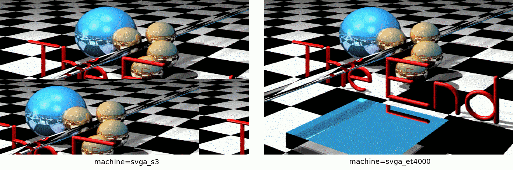

 
[[1992|Guide:MS‐DOS:demoscene:1992]] demoscene entry.

# Demo description

(todo)

# Recommended DOSBox-X configuration

    [dosbox]
    machine=svga_et4000
    memsize=1
    
    [cpu]
    core=normal
    cputype=386
    cycles=8000
    
    [sblaster]
    sbtype=sbpro2
    sbbase=220
    irq=5
    dma=1
    
    [speaker]
    initial frequency=0

# Incompatible VGA memory mapping trick

This demo appears to use a trick where 2 bits in the Graphics Controller registers can be modified to change where the VGA hardware maps it's video memory. Normally this 2-bit value is 1=A0000-AFFFF 2=B0000-B7FFF 3=B8000-BFFFF, but some cards allow mapping the first 128KB of RAM by setting it to 0 which maps to A0000-BFFFF. This demo apparently relies on that.

ET4000 SVGA is known to map the first 128KB the way the demo expects. Unfortunately not very many VGA cards actually support that. Most VGA cards if configured that way map the first 64KB twice. On hardware other than ET4000, the demo will not display correctly. This has been confirmed on real hardware as well.

# PC speaker beeeeeeeeep

For some reason, even if the demo uses Sound Blaster, the PC speaker is turned on and left on during the demo. Some quick testing with a mid 1990's Pentium laptop confirms the demo does the same thing on real hardware.

|Hardware|Video|Result|
|--------|-----|------|
|Toshiba Satellite Pro 465CDX|Chips & Tech 65554|64KB mapping, half a picture, same as machine=svga_s3 in DOSBox, but worse. Sound Blaster output can cut out at any time.|

# More information

[More information (Pouet)](http://www.pouet.net/prod.php?which=2072)
