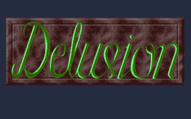

 
[[1992|Guide:MS‐DOS:demoscene:1992]] demoscene entry.

# Demo description

(todo)

# Recommended DOSBox-X configuration

    [dosbox]
    memsize=1
    machine=vgaonly
    
    [cpu]
    core=normal
    cputype=386
    cycles=10000

    [dos]
    minimum mcb segment=800
    
    [sblaster]
    sbtype=sbpro2
    sbbase=220
    irq=5
    dma=1

# Issues

This demo may have memory corruption issues if loaded too low in memory, especially during the pre-rendered raytraced Sonic PC animations.

# More information

[More information (Pouet)](http://www.pouet.net/prod.php?which=5137)
