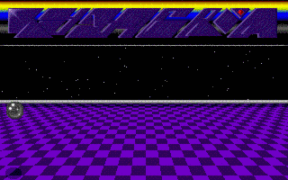

 
[[1992|Guide:MS‐DOS:demoscene:1992]] demoscene entry.

# Demo description

(todo)

# Recommended DOSBox-X configuration

    [dosbox]
    memsize=1
    machine=svga_s3
    
    [cpu]
    cycles=10000
    core=normal
    cputype=386
    
    [sblaster]
    sbtype=sbpro2
    sbbase=220
    instant direct dac=true

This demo supports Sound Blaster and LPT DAC playback. Sound Blaster is recommended. "instant direct dac=true" is recommended to avoid issues where the demo might write too fast to the DSP.

# More information

[More information (Pouet)](http://www.pouet.net/prod.php?which=4219)
