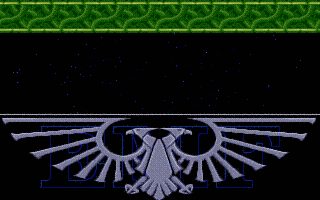

 
[[1992|Guide:MS‐DOS:demoscene:1992]] demoscene entry.

# Demo description

Scroller, starfield, palette animation, objects, and credits.

# Recommended DOSBox-X configuration

    [dosbox]
    memsize=1
    machine=vgaonly
    allow dma address decrement=true
    
    [dos]
    minimum mcb segment=400     # lower starting values may cause audible "glitches" when video mode changes
    
    [cpu]
    core=normal
    cputype=386
    cycles=8000
    
    [sblaster]
    sbtype=sb2
    sbbase=220
    dma=1
    irq=7
    io port aliasing=true

The demo requires that your Sound Blaster is configured for IRQ 7, DMA 1. It will not work with Sound Blaster otherwise.

# Unusual Sound Blaster requirements

The demo does two strange things with hardware that later cards and later emulation may not properly support.

## Sound Blaster I/O port aliasing

Sound Blaster support is relatively normal except that it relies on port 0x22D to submit DSP commands. On actual Sound Blaster 2.0 hardware, this I/O port is an alias of port 0x22C and works exactly the same. The demo does not have any code to time out if the DSP does not respond. This is why, if the demo is run on clone Sound Blaster compatible hardware, or on SB16 cards, the demo will hang on startup if asked to do Sound Blaster output.

To ensure the DOSBox-X works with this demo make sure you have this set in your dosbox.conf:

    [sblaster]
    sbtype=sb2
    io port aliasing=true

## DMA decrement mode

For reasons unknown at this time, the demo programs the DMA controller to run the Sound Blaster DMA in decrement mode. Instead of starting a DMA block with the memory address at the bottom counting up, the demo programs the address to the last byte of the DMA block, and instructs the DMA controller to count down. It seems to render audio backwards to match, so that you hear audio normally.

If the demo is run without DMA decrement emulation enabled, or on mainline DOSBox, you will only hear loud static, or the demo will just hang at startup.

Make sure your dosbox.conf is configured as follows:

    [dosbox]
    allow dma address decrement=true

# More information

[More information (Pouet)](http://www.pouet.net/prod.php?which=4182)
