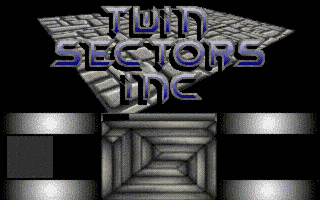
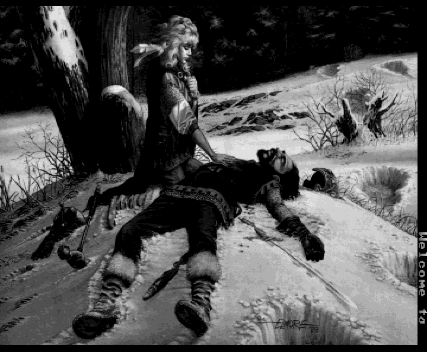

 
[[1992|Guide:MS‐DOS:demoscene:1992]] demoscene entry.

# Demo description

(todo)

# Recommended DOSBox-X configuration

    [dosbox]
    machine=vgaonly
    memsize=1
    
    [cpu]
    cycles=8000
    core=normal
    cputype=386
    
    [sblaster]
    sbtype=sbpro2
    sbbase=220
    irq=5
    dma=1

To run the demo type BOOT.BAT.

# VGA oddities

Part 4 of this demo (the greetings), prompts you on what VGA mode to use to display a graphic. The first option uses a nonstandard VGA mode 360x570 (it's actually 360x594) that is safe to use with DOSBox-X, though not recommended for non-multisync VGA monitors. The second option uses 360x480 (also safe). DOSBox-X has been updated to handle the 360x570 mode despite that some of the CRTC registers contain invalid values.

# Bugs

Running the demo with BOOT.BAT will run all sections properly, except that part 3 will run without music. To run part 3 with music, run it manually by typing "PART3.EXE". Answer 'Y' when the part asks if you want music.

# More information

[More information (Pouet)](http://www.pouet.net/prod.php?which=2073)
