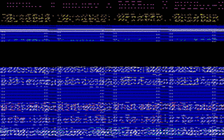

 
[[1992|Guide:MS‐DOS:demoscene:1992]] demoscene entry.

# Demo description

(todo)

# Recommended DOSBox-X configuration

    [sblaster]
    sbtype=sbpro2
    sbbase=220
    irq=7
    dma=1
    
    [cpu]
    core=normal
    cputype=386
    cycles=12000
    
    [dosbox]
    memsize=1

To start the demo, type RUN.BAT. The demo assumes a Sound Blaster on IRQ 7, DMA 1.

# Bugs

Prior to a bugfix in DOSBox-X that split up REP string operations, the demo would hang during the credits. This is apparently not the case anymore.

# More information

[More information (Pouet)](http://www.pouet.net/prod.php?which=4222)
