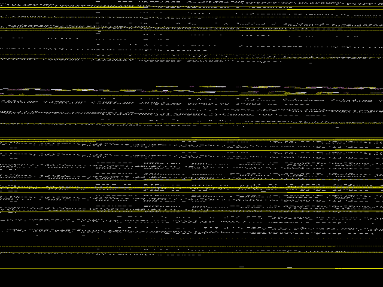

 
[[1992|Guide:MS‐DOS:demoscene:1992]] demoscene entry.

# Demo description

Simple demo with varied text scroller and music.

# Recommended DOSBox-X configuration

    [dosbox]
    memsize=1

    [cpu]
    core=normal
    cputype=386
    cycles=4000

    [sblaster]
    sbtype=sbpro2
    sbbase=220
    irq=5
    dma=1

# More information

[More information (Pouet)](http://www.pouet.net/prod.php?which=58778)
