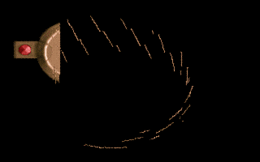

 
[[1992|Guide:MS‐DOS:demoscene:1992]] demoscene entry.

# Demo description

(todo)

# Recommended DOSBox-X configuration

    [dosbox]
    machine=svga_s3
    memsize=1
    
    [cpu]
    cycles=12000
    core=normal
    cputype=386
    
    [sblaster]
    sbtype=sbpro2
    sbbase=220
    dma=1
    irq=7
    
    [autoexec]
    mount c: .
    c:

# More information

[More information (Pouet)](http://www.pouet.net/prod.php?which=4074)
