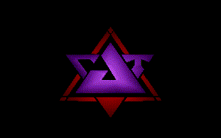

 
[[1991|Guide:MS‐DOS:demoscene:1991]] demoscene entry.

# Demo description

Basic demo with scrolling starfield, meters, and MOD music.

# Recommended DOSBox-X configuration

    [dosbox]
    machine=vgaonly
    memsize=1
    iodelay=0
    
    [cpu]
    cycles=5000
    core=normal
    cputype=386
    
    [speaker]
    pcspeaker=true
    initial frequency=0

Demo uses the internal PC speaker for music. A bug in the demo leaves the PC speaker on before the music starts, you can eliminiate the initial long beep by setting "initial frequency=0". Music is amplified and slightly distorted. You can hear a higher quality rendition by using a dedicated MOD player like [MikMod](http://mikmod.sourceforge.net/) or [VLC player](http://www.videolan.org/vlc/index.html) to play the files.

# How to run

Mount the demo so that it is visible under a drive letter in DOSBox. The demo expects you to run TORSO.BAT so that it can display a message, wait for you to hit enter, then run the demo (P.COM).

    It was only a Test-version but the SOURCE is lost.
    So enjoy this last version.
    
                       sign: TomCat

You can run the demo as intended:

    call torso.bat

Or jump directly into the demo:

    P.COM

# DOSBox-X bugs

## Scratchy PC speaker audio

Except when core=dynamic, PC speaker audio gets "scratchy" when a lot of video redraw happens, or during VGA palette fades.
Until resolved, the workaround is to set iodelay=0.

# More information

[More information (Pouet)](http://www.pouet.net/prod.php?which=5260)
