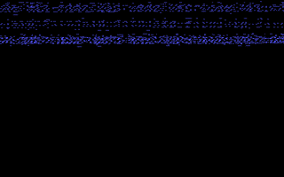

 
[[1992|Guide:MS‐DOS:demoscene:1992]] demoscene entry.

# Demo description

(todo)

# Recommended DOSBox-X configuration

    [dosbox]
    machine=vgaonly
    memsize=1
    
    [cpu]
    core=normal
    cputype=386
    cycles=9000
    
    [dos]
    int33=true # INT 33h mouse emulation
    
    [sblaster]
    sbtype=sbpro2
    sbbase=220
    irq=5
    dma=1
    
    [speaker]
    initial frequency=0

To run the demo, type RUNME.BAT

You should enable INT 33h mouse emulation. Some parts of the demo rotate an object, then invite you to rotate it with the mouse and play with the object.

# Alternate configuration for better music quality

The demo's default settings produce very low-fidelity MOD music playback (5KHz!). You can get better audio playback by running the demo directly and changing the dosbox.conf as follows:

    [cpu]
    core=normal
    cputype=386
    cycles=20000

Then type:

    vv odyssey2.mod 22050

The demo should run through it's routines with much better sounding music.

# More information

[More information (Pouet)](http://www.pouet.net/prod.php?which=4256)
